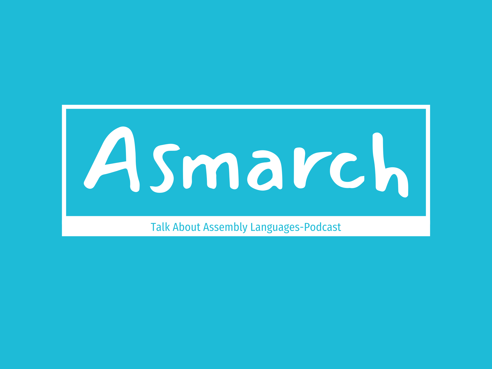

# Asmarch
Talk about assembly languages, open-source and computer architectures

## Episodes
+ Episode 1: GNU Philosophy,Free Assembly Languages, GNU Assembler

### Info: 
Subscribe for the podcast: [asmarch](https://asmarch.github.io/asmarch/podcast/feed.xml).  
About Me: [about](https://vrstanchev.github.io/vrstanchev).
